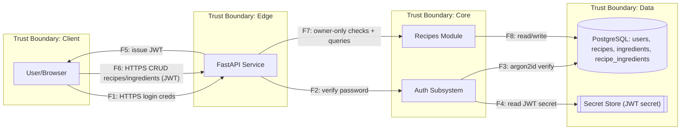

## Диаграмма

## Список потоков
| ID | Откуда → Куда | Канал/Протокол | Данные/PII | Комментарий |
|----|---------------|-----------------|------------|-------------|
| F1 | User → API    | HTTPS           | Логин/пароль | Аутентификация пользователя |
| F2 | API → AUTH    | In-Proc/Call    | userId/hash | Вызов подсистемы аутентификации |
| F3 | AUTH → DB     | TCP             | хэш пароля  | Проверка hash (argon2id) |
| F4 | AUTH → SECRET | Local/SDK       | секрет JWT  | Чтение секрета из Secret Store |
| F5 | API → User    | HTTPS           | JWT         | Выдача токена |
| F6 | User → API    | HTTPS           | JWT + payload | CRUD /recipes, /ingredients, /recipes?ingredient= |
| F7 | API → REC     | In-Proc/Call    | userId, recipeId | Owner-only проверка/бизнес-логика |
| F8 | REC → DB      | TCP             | данные рецептов | Запросы/модификации данных |
